## Self::identity

其实 `charliez0` 才是我的主号，`lolifamily` 这个名字是一时兴起的小号名字，原计划用于一些社区活动。

自从我成功申请到 https://lolifamily.js.org 这个永久可托管 [Cloudflare](https://www.cloudflare.com/) 的域名后[^1]，我就决定用这个域名作为我的主站域名。
`js.org` 的 reputation 远高于其他如 `eu.org` 的二级域名或者 `xyz` 数字域名等，存在于大多数境内防火墙白名单中，更利于国内访问以及 SEO 优化。
因此这个名字的使用优先级进一步提高，~~甚至超过了我的主号使用~~。

也许这样也挺好的呢？

## Self::status

我是一个在技术上比较挑战的人，对可以解决的 warning 以及隐形 bug 零容忍，尽力追求完美的技术解决方案。

对一切事物保持好奇心（~~尽管经常提出奇奇怪怪的问题~~），积极思考是否有更优的更有意思的解决方案，并在合适时机尝试自己解决。

make our world a better one, not a worse one.

## Self::skills

目前主力学习应用 Nodejs 和 C++，准备学习 Python（特别是 [Mojo](https://docs.modular.com/mojo/manual)），
计划在将来学习 Rust 和 Go 并构建更高效的微服务。

关于人工智能领域，我准备从高数开始构建我的数学知识体系，并逐步学习机器学习、深度学习等知识。
同时，我也计划研究 Prompt Engineering 和 Agent 相关知识，并尝试构建幻觉更低的 AI 应用。

## Self::ongoing

使用 Astro 和 MDX 重写主站 [lolifamily.js.org](https://lolifamily.js.org)。
完成 `DD_Monitor` 和 `hSC` 的开发。

[^1]: 目前 `js.org` 已经停止新增 `NS` 托管，目前 `NS` 累计通过域名数仅一位数，质量上乘。
